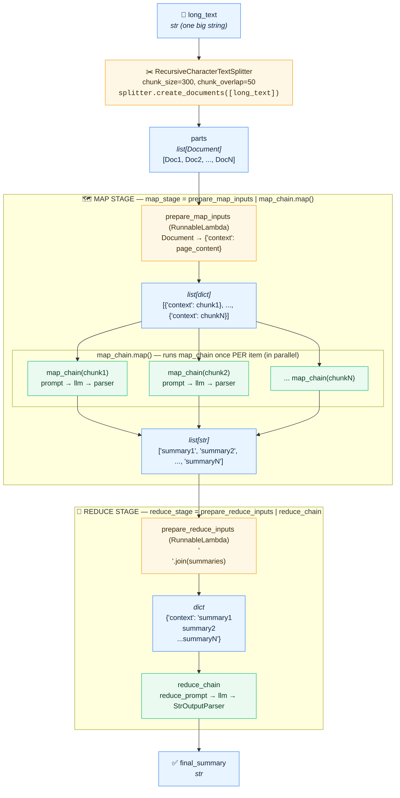
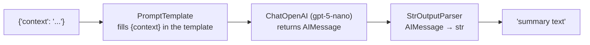
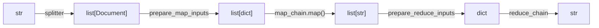

# 7 - Pipeline de Sumarização (Map-Reduce) — Visual Guide

## 1. The big picture



**Legend:** 🔵 blue = data (what's flowing) · 🟠 orange = plain Python transforms · 🟢 green = LLM calls

---

## 2. What's inside `map_chain` and `reduce_chain`

Both are the same shape (`prompt | llm | parser`); only the prompt text differs.



| Chain          | Prompt                                                   | Called how many times? |
|----------------|----------------------------------------------------------|------------------------|
| `map_chain`    | "Write a concise summary of the following text:"         | **N** (once per chunk) |
| `reduce_chain` | "Combine the following summaries into a single concise…" | **1**                  |

---

## 3. What does `.map()` do?

`map_chain.map()` takes a chain that handles **one** input and makes it handle a **list** of inputs.
It's the LCEL version of a list comprehension:

```python
# These two do the same thing (except .map() runs the calls in parallel):
map_chain.map().invoke(list_of_dicts)
[map_chain.invoke(d) for d in list_of_dicts]
```

---

## 4. How the data changes shape



Most of the confusing parts come from this: each `RunnableLambda` exists only to **reshape the data** so the next step gets the input it expects.
`PromptTemplate` expects a `dict` with a `context` key, so:
- before the map, `Document` objects are turned into `{"context": ...}` dicts
- before the reduce, the list of summaries is joined into one string and wrapped in `{"context": ...}`

---

## 5. The last line, unpacked

```python
final_summary = reduce_stage.invoke(map_stage.invoke(parts))
```

is equivalent to:

```python
summaries     = map_stage.invoke(parts)        # list[str]   (N LLM calls)
final_summary = reduce_stage.invoke(summaries) # str         (1 LLM call)
```

You could also compose them into one pipeline: `(map_stage | reduce_stage).invoke(parts)`.
